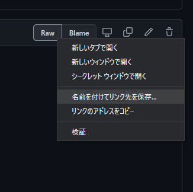

# ケイロミ共和国用語・単語IME辞書

https://user-images.githubusercontent.com/6637993/145686821-6af0e18f-d412-4e0a-aacf-2eec52a95a6d.mp4

ケイロミ共和国の関連用語の辞書ファイルです。

次の法則でケイロミワードを変換できるようになります。

- 推しマーク - `：`の後に名前またはあだ名で変換
- タグ - `＃`の後に名前またはあだ名で変換
- ファンネーム - `〜`の後に名前またはあだ名で変換
- ツイッターID - `＠`の後に名前またはあだ名で変換

**具体的な変換例：**

|変換前|変換後|
|---|---|
|：あませ|☂️|
|：あすき|🌹🏰|
|＃りもね|#生りもね|
|＃りもね|#りもあーと|
|～ぺえ|タコ民|
|～ぺえちゃん|タコ民|
|～なあか|おにくたち|
|＠わかば|@touou_wakaba|
|＠なあか|@7naaka|
|あかばみあすき|赤波見遊城|
|かわらべえくま|河童エクマ|

## 使い方

辞書データの読み込み方法について説明します。  
テキストファイルをダウンロードしたあと、ユーザー辞書ツールに読み込ませて使います。

### ダウンロード

[Downloadsはこちらから](/downloads)

環境に合わせてテキストファイルページの「Raw」ボタンを右クリックしてダウンロードしてください。

### インストール方法

下記、`@heppokofrontend/dictionary-file-maker`のドキュメントを参考にしてください。

- [WINDOWS](https://github.com/heppokofrontend/dictionary-file-maker/blob/main/WINDOWS.md)
- [MACOS](https://github.com/heppokofrontend/dictionary-file-maker/blob/main/MACOS.md)
